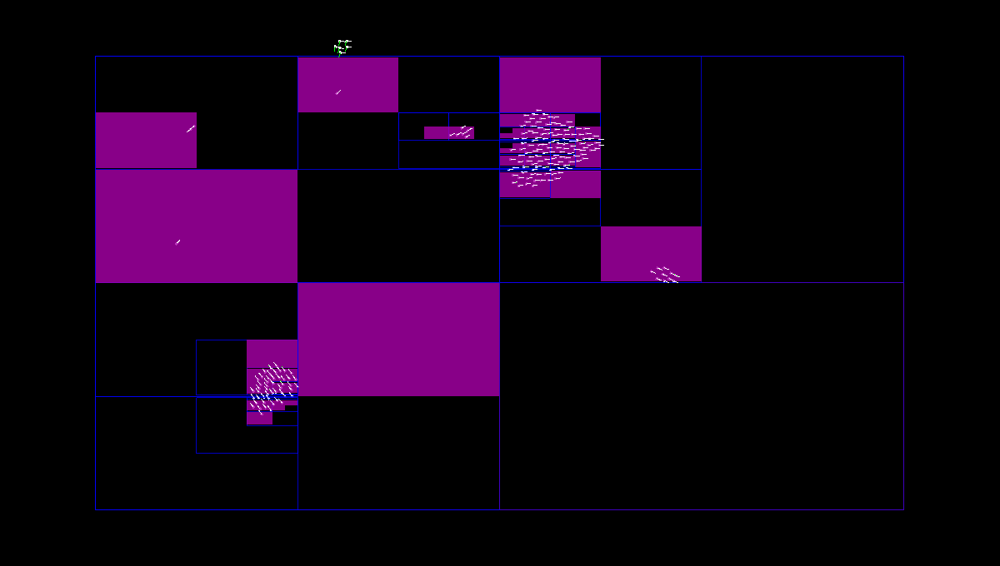
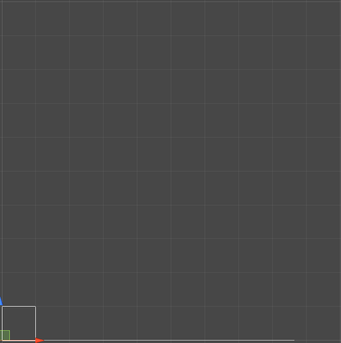

# DragonSpace-Demo
 A simple boids simulation to show the difference between implementations of a few spatial partitioning structures in Unity.

 

 This is a C# implementation of the data structures described in [this StackOverflow answer](https://stackoverflow.com/questions/41946007/efficient-and-well-explained-implementation-of-a-quadtree-for-2d-collision-det) by user Dragon Energy, along with some boids to test them with. The boids themselves are very simple and not terribly pretty, but the only important part is that they're consistent test subjects.

 The linked series of answers are an extremely detailed explanation of the concepts behind spatial partitioning in general, quadtrees and grids in particular. [This section](https://stackoverflow.com/a/48355534) covers the fundamentals. They also include code in C and Java, which is what I started this project by porting. 

## Using the code

 This is the first code I've posted publicly so it isn't very user friendly yet. I hope to improve it as I integrate it into an actual project. Currently there are no Unity-specific functions as I wanted to keep it fairly engine agnostic, but the quadtrees all inherit from a common base class to make it easier to switch between them. All methods should have quite verbose metadata, though this may mean some errors in descriptions slipped through as code changed. Apologies if they did.

 The quadtrees store an axis-aligned bounding box for each element, so you insert elements with `InsertPoint()` or `InsertRect()`, providing a reference to the elment (which can just be `GameObject`) and `int` values for the size. Bounding boxes are stored as point-size, with the origin point in the bottom-left. 

 The grids leave the bounding box up to the elements themselves, so elements must implement `IGridElt` for the loose double grid or `IUGridElt` for the uniform grid. This seemed like a nice way to save memory since I would be using this with GameObjects that always needed to store a transform anyway. I haven't written a version that stores the bounding boxes to profile if it's actually more performant.

### Shortcomings

 These are only designed to improve relatively coarse spatial queries, which is why the quadtrees store integers and not floats. In the course of creating this project, I created a simple 2D collision detection test with rectangles. Even the simplest implementation was far slower than Unity's built-in physics system, so this is unlikely to improve performance for any game that requires proper collision detection.

 Likewise, there currently is no consideration for rotating an object in a way that would change its bounding box. This is easy enough to deal with by removing and re-inserting elements, which isn't much slower than moving them in the quadtree structures. However it does mean that the ideal use case may be objects with fairly consistent bounding boxes.

 The combination of singly-linked lists with storing elements via interface means that for the grid structures, if an element is destroyed without first removing it from the grid, the list will be broken. **This will most likely result in an infinite loop** the next time that element's cell is checked. There isn't currently a built-in error check for that, you've been warned. For the quadtrees, this will just result in a memory leak as elements will be stored unnecessarily and prevent empty nodes of the tree from being cleaned up.

### Beginner warning

Another one of the main concepts explained in those answers is the importance of not storing lists of elements in each node - again for cache locality. This means that usually elements are stored in one big list for the whole tree, and nodes store indexes to that list. Nodes and elements are often using singly-linked lists, which cuts down on memory. This is a great trick, but can be kind of confusing, or lead to bugs like infinite loops if an element isn't found in the node where it's supposed to be. I've tried to expand on explanations in the comments, but if you're for some reason finding this code without already understanding quadtrees, it's definitely easier to implement one in the simplest way possible before trying to make sense of this version.


# General Information

If you aren't familiar with the concepts behind spatial partitioning, (or if you're like me and prematurely optimizing a game that you haven't even prototyped) here's a broad explanation of how this applies to Unity games. For a more detailed explanation, read the StackOverflow answers linked at the top. I'm very far from an expert, but most information I found was not beginner friendly, or didn't mention more appropriate solutions like grids, assuming the reader already knew the most appropriate structure for their use. Hopefully I can save someone else the trip down that rabbit hole.

---

##General terminology

* **Linear search**: Going down every element of a list looking for the one you want
* **O(n^2)**: A way of noting [time complexity](https://en.wikipedia.org/wiki/Time_complexity) of an algorithm. If you have to compare every element of a list to every other element of a list, it will take 100 comparisons for a list of 10 elements. This is the problem we're trying to avoid.
* **Space Partitioning**: Dividing a space into smaller regions.
* **Broad phase or broadphase algorithm**: A first step in collision detection (or queries) to avoid having to compare the object we're checking for collisions against every other one in the world.
* **Bounding box**: The smallest box that fully encloses an object, regardless of its non-box shape. Generally this is used as a way to simplify broad phase checks.
* **Axis-aligned bounding box (AABB)**: A bounding box aligned to the axes of the world, so that different objects' rotation doesn't need to be accounted for. This further simplifies the broad phase process.

**Common methods**

* [Sweep and prune](https://en.wikipedia.org/wiki/Sweep_and_prune): The bounds of each object are stored in a list (or lists) sorted by their position on an axis. Therefore, if two objects bounding boxes overlap on the X axis, they should be checked for collision. However they may be very distant from each other on the Y axis.
* **Grids**: The simplest way to partition space. If an object is at x:90 and grid cells are 100 units wide, it goes in the first column. If it's at x:101, it goes in the second column. Same process for each axis. Note that this requires making a grid for your entire space, so it's very fast, but empty space can use a lot of extra memory.
* **Quadtrees (for 2 dimensions) & Octrees (for 3 dimensions)**: Note that quadtrees for games are not the same as quadtrees for image compression, map data, and many other places they're used. Quadtrees for images essentially say "every point in this area is this color". For games, they're used as a way to split up a list of elements with bounding boxes by their location.    
Objects are inserted into a list, and when the list gets too long, the space is split into four quadrants (like a grid with four cells). Each quadrant has its own node (list of elements). When one of those nodes gets too crowded, it splits again. So quadtrees are adaptive, and great if you end up frequently querying empty areas. Objects that overlap quadrants are inserted into all relevant nodes.
* **Loose trees**: Trees that allow quadrants to overlap, so that objects only have to be inserted into one node. 
* **BSP tree**: [Binary Space Partitioning](https://en.wikipedia.org/wiki/Binary_space_partitioning), a way to split up a space that isn't square. Often used in graphics rendering.


## Spatial Partitioning in Unity

This all started because I wanted to do something pretty common - find the nearest GameObject within a certain range, in a game with thousands of units. This is simple to do with `Physics.OverlapSphere()` but that can feel very frustrating or wasteful when you aren't using the physics system for anything else. Furthermore, if you're making an RTS or other game where everyone is going to be on the ground you might also think "why do I have to search 3 dimensions when I'm not using one of them". Then you might think to yourself "I can come up with a better solution".

In reality, it's plenty fast, and *dramatically* simpler than spending a few weeks learning about spatial partitioning and low-level programming optimizations that can't be implemented in C#. Just use colliders configured as triggers and make your game. HOWEVER, if all you need to do is find the nearest object, or find the objects within a query area, it can certainly be faster. Especially in cases where you'll frequently be querying potentially empty areas, when you're using 3d objects but don't need 3d partitioning, and so on.

The project includes boids using Unity's colliders in multiple configurations as a baseline comparison. In some cases, the speed is comparable if not faster, and a quick glance at the code shows how much simpler it is to use. 

Aside from having to implement, maintain, and troubleshoot the quadtree structure itself, compare the loop to spawn boids into the simulation. With physics:

```
private void InitPhysics()
    {
        for (int i = 0; i < sets.testElements; ++i)
        {
            Vector3Int pos = new Vector3Int(r.Next(sets.bounds.width), 0, r.Next(sets.bounds.height));
            Instantiate(physicsBoidPrefab, pos, Quaternion.identity);
            ++entityCount;
        }
    }
```

With the quadtree:
```
private void InitQuadtree()
    {
        if (autoConfig)
            qt = QuadTree<BoidBase>.NewTree(sets.bounds.width, sets.bounds.height, 2);
        else
            qt = new QuadTree<BoidBase>(sets.bounds.width, sets.bounds.height, elementsPerQuad, maxDepth);

        for (int i = 0; i < sets.testElements; ++i)
        {
            Vector3Int pos = new Vector3Int(r.Next(sets.bounds.width), 0, r.Next(sets.bounds.height));
            GameObject go = Instantiate(boidPrefab, pos, Quaternion.identity);
            go.TryGetComponent(out Boid b);
            b.Init();
            b.index_TEMP = qt.InsertPoint(b, b.X, b.Y, b.Width, b.Height);
            ++entityCount;
        }
    }
```

Not a huge difference, but definitely more opportunities to make mistakes. (which I did. A lot.) So please don't use this for prototyping!

If you're curious, Unity's default broadphase algorithm is PhysX's sweep-and-prune. From the [Nvidia PhysX documentation](https://docs.nvidia.com/gameworks/content/gameworkslibrary/physx/guide/Manual/RigidBodyCollision.html#broad-phase-algorithms) on sweep and prune:

>It is a good generic choice with great performance when many objects are sleeping. Performance can degrade significantly though, when all objects are moving, or when large numbers of objects are added to or removed from the broad-phase.

They [now provide the option](https://blogs.unity3d.com/2019/10/22/physics-updates-in-unity-2019-3/) (in Project Settings -> Physics -> Broadphase Type) to change it to multibox pruning, which divides the world into grid cells, and uses sweep and prune on the objects in each cell. According to the tooltip this is likely only useful if there are a lot of overlaps on the Y axis. I tried multibox (both manual and automatic) pruning in this boids simulation and didn't see any noticeable difference in speed, but that will vary a lot depending on the project.

## 3D vs 2D

These are 2 dimensional structures because that's the only common case where they offer any improvement over using Unity's built-in tools. A simple compromise would be just flipping your world so that up was facing the camera in 2D, then using 2D colliders on 3D objects. In practice, this has two issues. The first being if your game can't be flipped for some reason (although it is possible to change the direction of gravity in the settings). More importantly, Unity's 2D physics aren't actually very fast. This is apparently changing in [upcoming versions](https://www.youtube.com/watch?v=Xxbs9x2qB7Y) but in my tests, using 2D colliders actually ended up being noticeably slower than 3D physics. This is largely because they can't be configured as triggers without rigidbodies like the 3D colliders. So while `OverlapCircle()` is faster than `OverlapSphere()`, the improvement is offset by the time spent updating transforms and running the simulation. This may change when the 2D physics are updated, if so, the 2D simulation should run faster on a new version of Unity with no code changes necessary. (When I add it to this repo)

## Quadtrees for games



I'm not going to be able to give a better explanation of the detailed concepts than the linked answer, but for a quick overview:

Quadtrees (and k-d trees, etc.) are one of the go-to answers when searching for solutions to this problem online. It can be a bit confusing as a beginner because quadtrees are frequently used for things like image compression, which is a completely different use and structure than a quadtree for finding objects in a space, or doing collision detection. In this case, we're (if I'm not mistaken) talking about what Wikipedia refers to as point-region quadtrees. Every object in the tree is stored with information about the space it occupies - its bounding box.

This quadtree implementation uses very little memory for the nodes. The original C code its based on is apparently much faster for queries than the loose quadtree, but slower for insertion and removal of elements. This isn't the case in my implementation. That may be due to my implementation, limitations of C#, or a combination of both. I'm not sure. 

 

The loose quadtree speeds up operations by only inserting objects into a single leaf, and each node of the tree changes its boundaries to exactly encompass its children (either nodes or elements). This means that they can overlap, handling objects on the border between quadrants. Most importantly, this means that if a query doesn't overlap with any nodes at the top level of the tree, there's no need to traverse the tree further or to look at the list of elements at all.

## Grids

Since a major benefit of quadtrees is that they allow you to ignore large empty areas, they aren't actually a great solution for games where space is very crowded and/or evenly filled with objects. In this case, the simplest solution is also faster. Divide the space into grid squares like a map and insert objects into the relevant cells. When querying, figure out which cells overlap your query and go through their lists.

This project includes two grid implementations. One is a grid for objects that all have identical sized bounding boxes (see the ["Dirty trick"](https://stackoverflow.com/a/48400502) section of the StackOverflow answer). This is a perfect structure for the boids simulation.

The second is the "[Loose/Tight Double-Grid](https://stackoverflow.com/a/48384354)". This applies the concept of loose nodes from the loose quadtree to a grid, allowing for a bit of the best of both worlds. A lot of the speed of grids in the original examples there (aside from being written in C/C++) comes from the ability to optimize the layout of elements in memory for efficient cache usage. I haven't done any of that optimization but I hopefully will come back to it in the future. On the other hand, I applied the singly-linked list concept from the other code to completely bypass storing lists of elements in the grid at all, by using an interface implemented by objects to be inserted. This can theoretically save memory at the cost of speed but I haven't profiled it. I mostly did it because it seemed like a fun idea and slightly easier to use.

## License

I don't really know what license is appropriate, but the quadtree C/Java code was posted on StackOverflow with this disclaimer:

> "But feel free to grab the code and put it on GitHub if you like. And adapt it all you like and use it in commercial applications, take full credit, whatever. I don't mind. It's just a couple hours of work and I like seeing people do cool things and I prefer to be in the background."

Any other code I used for reference was posted on Pastebin with no license. So use this code at your own risk, it is almost certainly riddled with bugs.
